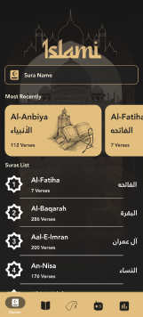
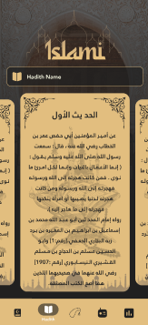
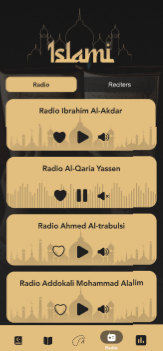

# 🕌 Islami App | تطبيق إسلامي

تطبيق إسلامي متكامل مبني باستخدام **Flutter** يوفر تجربة مستخدم مميزة وعصرية لقراءة القرآن الكريم، الاستماع للأحاديث النبوية، والتسبيح، والراديو.

---

## 📱 شاشات التطبيق (App Gallery)

### 🔹 الهوية والبداية (Identity & Intro)
تتميز الشاشات بتصميم إسلامي عصري وألوان هادئة.
<div align="center">

| شاشة البداية |
|:-------------:|
|  |

</div>
### 🔹 رحلة المستخدم (Onboarding Journey)
شاشات توضيحية لمميزات التطبيق للمستخدم الجديد.

| الخطوة 1 | الخطوة 2 | الخطوة 3 | الخطوة 4 |
|:---:|:---:|:---:|:---:|
|  |  |  |  |

### 🔹 المميزات الأساسية (Core Features)
واجهات منظمة للوصول السريع للقرآن والأحاديث والخدمات الأخرى.

|               القرآن الكريم                | الأحاديث النبوية | السبحة الإلكترونية | راديو القرآن | الاذكار ومواعيد الصلاة |
|:------------------------------------------:|:---:|:---:|:---:|:---:|
|  |  |  |  |  |

---

## ✨ المميزات التقنية (Technical Features)

*   **📖 Reading Experience:** عرض السور والآيات بتنسيق مريح للعين مع دعم الخطوط العثمانية.
*   **📜 Hadith Carousel:** استعراض الأحاديث النبوية باستخدام `CarouselSlider` التفاعلي.
*   **📿 Digital Tasbeeh:** عداد تسبيح ذكي يحفظ عدد التسبيحات.
*   **📻 Live Radio:** بث مباشر لإذاعات القرآن الكريم باستخدام تقنيات الـ Streaming.
*   **📱 Responsive UI:** واجهات متوافقة مع جميع أحجام الشاشات بفضل مكتبة `Sizer`.

---

## 🛠️ التقنيات (Tech Stack)

| التقنية | الوظيفة |
| :--- | :--- |
| **Flutter/Dart** | الإطار البرمجي الأساسي |
| **Provider** | إدارة الحالة (State Management) |
| **Shared Prefs** | الحفظ المحلي للبيانات واللغة |
| **Http** | جلب بيانات الراديو من الـ API |
| **Google Fonts** | الخطوط العربية الاحترافية (Tajawal/Amiri) |

---

## 🚀 كيفية التشغيل (Setup)

```bash
# Clone the repository
git clone https://github.com/your-username/islamic.git

# Install dependencies
flutter pub get

# Run the app
flutter run
```

---

> **Note:** المجلد `image` مخصص للعرض فقط في GitHub ولن يتم تضمينه في ملف الـ APK النهائي لتقليل الحجم.
